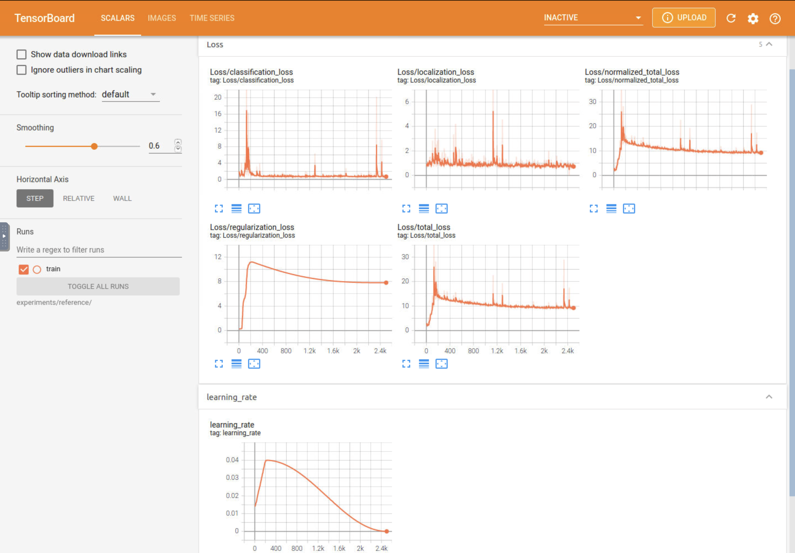
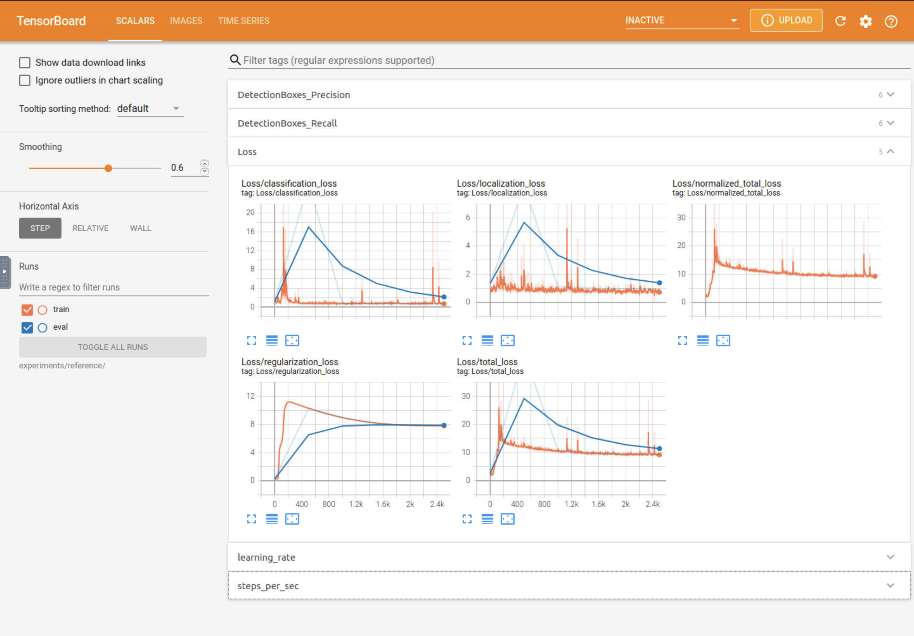
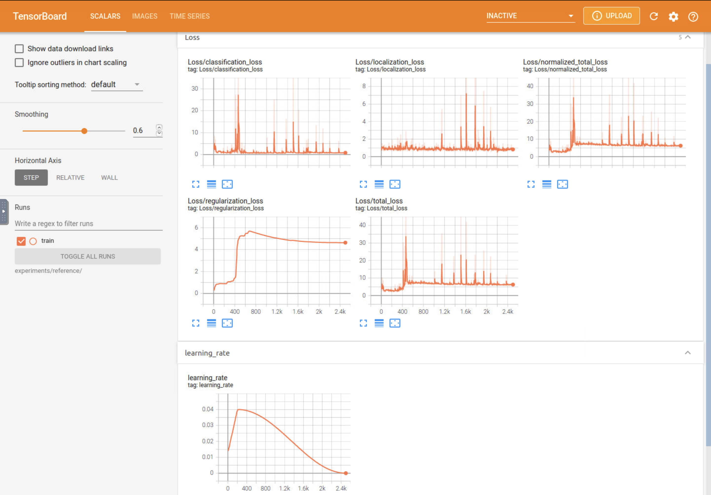
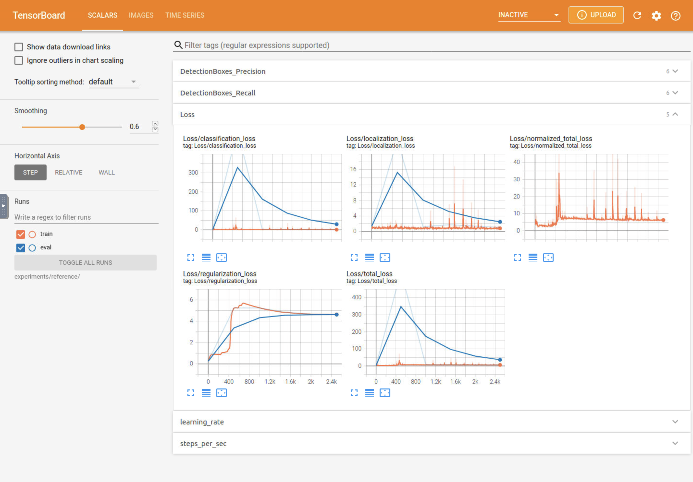
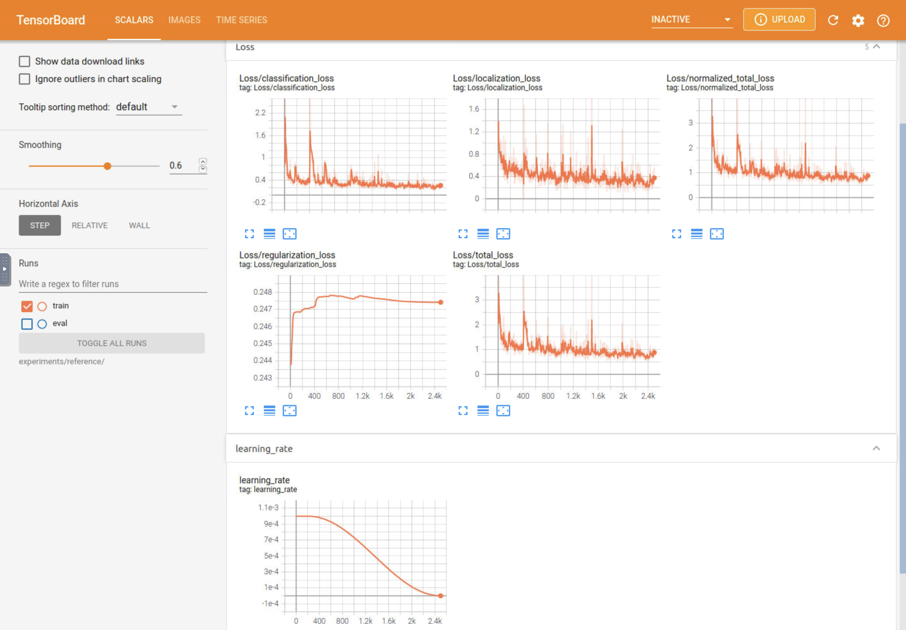
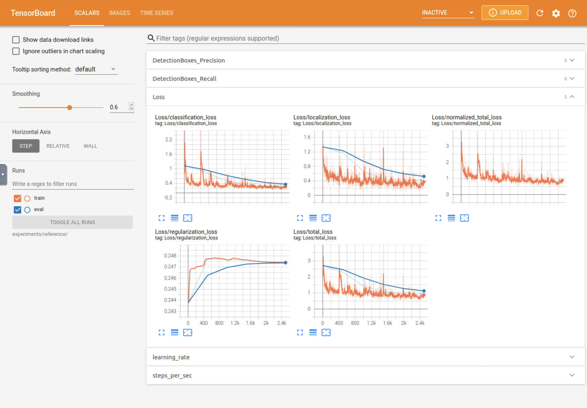
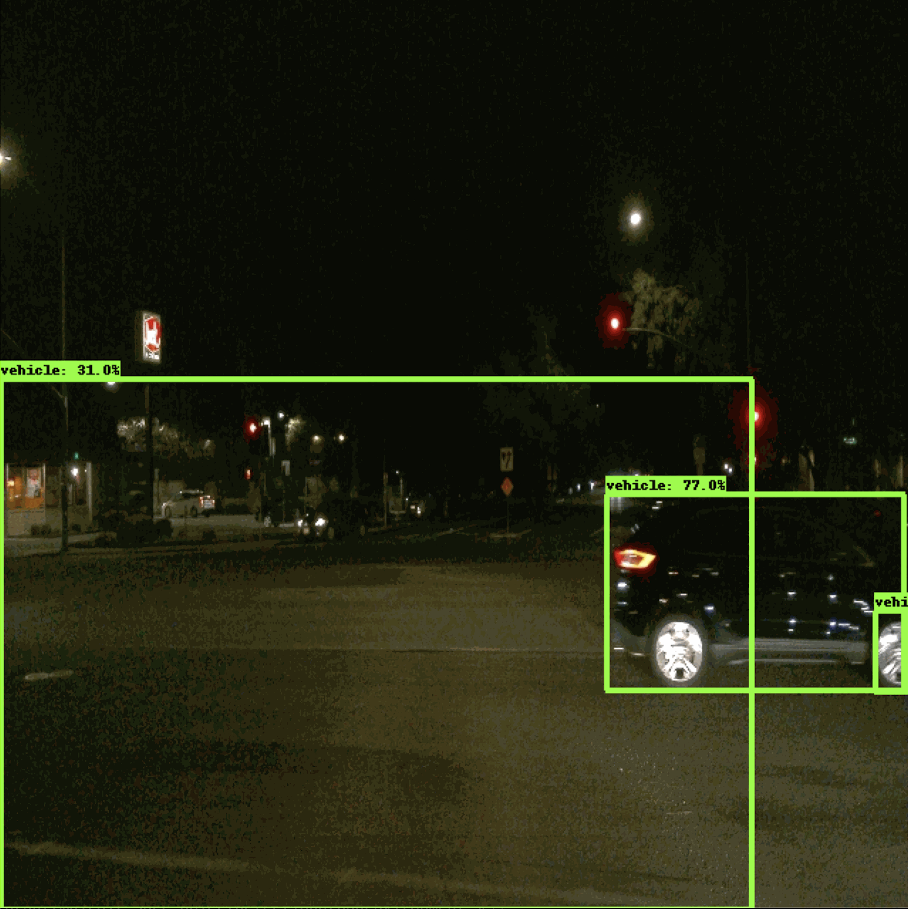
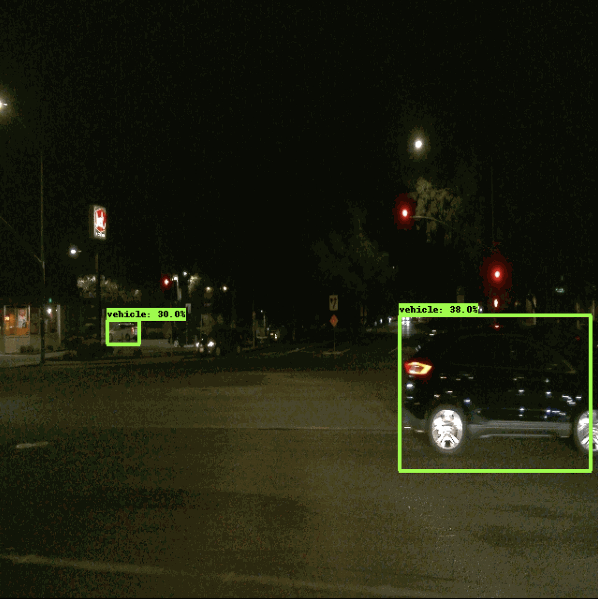

## Project Submission Writeup

### Project overview
This project uses data from the [Waymo Open dataset](https://waymo.com/open/) to train an object detection model and explore different training methods that are available to create an effective model. MORE

### Set up
The [README](/README.md) contains detailed steps to set up and train a model. Below is a brief summary of the process.

1. Create a local setup or in my case, use the Udacity provided workspace.
2. Download and the Waymo data.
3. Split the data appropriately into training, validation, and testing sets.
4. Perform exploratory data anlysis.
5. Train and evaluate the initial model.
6. Explore various types of data augmentations.
7. Run experiments to improve on the initial model performance. Altering the config file for each experiment.
8. Save models for each experiment and create inference videos to better understand the models overall performance.

### Dataset
#### Dataset analysis
Exploratory data analysis is a very important process and should be the first step taken when training a new model. Sample output images generated by the process are shown below. Given the below sample of 10 images, there are 6 taken in clear daylight, 2 including weather events, 1 taken around dusk and 1 taken at night. From this, it is likely that the entire dataset follows a similar distribution in which a majority of the images show clear daylight conditions, with a smaller majority including factors such as weather and low lighting. Knowing this, it will be key to include data augmentations that can simulate more factors to improve the models performance in all conditions and lighting instead of being focuses on perfect conditions only.

| EDA Output      |               |
| :-------------: | :-----------: |
|           |          |
|           |          |
|           |          |
|           |          |
|           |          |

Additional data analysis was performed to better understand the distribution of classes throughout the images of the dataset. For a 1000 image batch of the dataset, the distribution by class follows the below chart. In this 1000 image set, the counts for each class are 17723 vehicles, 5191 pedestrians, 143 cyclists. Understanding the distribution can allow for more precise tuning of the model. For example, if there are few cyclists compared to pedestrians, it would be important to choose tuning parameters and other model factors that are able to train the model appropriately given the small number of relative instances of the cyclist class in the dataset. 

#### Cross validation
The data supplied in the project workspace is already split appropriately with 86 files for training (~90%), 10 files for validation (10%), and 3 files for testing. This split of the data follows standard practices of 80-90% for training and 10-20% for validation. It is important to have separate data for training, validation, and testing to reduce overfitting and improve the general performance of the model. The validation set is particularly useful when choosing model parameters and fine tuning performance through experimentation. It is important to have a separate test set and to not evaluate with this set until after cross-validation is complete, or else there is a risk of data leakage between the training and validation sets.

### Training
#### Reference experiment
The reference experiment ran 2500 steps, included minimal data augmentations and used the momentum optimizer with a cosine decay learning rate of 0.04.

The reference experiment had poor performance with the following [losses](/experiments/experiment0_reference/results/train.txt) during training, summarized below.

| Step   | Loss   |
| :----: | :----: |
| 100    | 15.317 |
| 500    | 11.792 |
| 1000   | 10.362 |
| 1500   | 10.067 |
| 2000   | 9.199  |
| 2500   | 9.298  |

The reference experiment was unable to properly detect objects in the generated inference video.

#### Improve on the reference
Due to the poor performance of the initial training several experiments were performed to improve on this including adding data augmentations and updating the optimizer parameters. The following table outlines the three experiments and a summary of the changes tested.

| Experiment           | Tested Changes |
| :------------------: | :------------: |
| 1 - Augmentations    | Added data augmentations |
| 2 - Learning Rate    | Updated learning rate of base model |
| 3 - Optimizer        | Changed optimzer to Adam and implemented manual step learning rate |

The provided Explore Augmentations notebook made it easy to visualize the effects of different data augmentation methods. The outputs of my exploration can be found [here](/ExploreAugmentations_output/). I chose to use augmentations that would best simulate real variations that could be found in the available dataset images.

##### Experiment 1
Experiment 1 uses the reference model setup but adds several data augmentations, see below.

| Augmentation (link)             | Reason |
| :----------------------: | :-----------: |
| [random_horizontal_flip](/ExploreAugmentations_output/rand_flip.png)   | Can add variability to the image orientation |
| [random_crop_image](/ExploreAugmentations_output/rand_crop.png)        | Can remove some of the context of the original image |
| [random_black_patches](/ExploreAugmentations_output/rand_patch.png)     | Can mimic obstructions in front of the target objects |
| [random_adjust_brightness](/ExploreAugmentations_output/rand_brightness.png) | Can simulate harsh light or no light conditions |
| [random_adjust_saturation](/ExploreAugmentations_output/rand_sat.png) | Can simulate variations in image coloring |
| [random_adjust_contrast](/ExploreAugmentations_output/rand_cont.png)   | Can simulate variations in image dynamic range|
| [random_jpeg_quality](/ExploreAugmentations_output/rand_jpeg.png)      | Can mimic poor quality camera images |

Experiment 1 had improved, but still poor performance with the following [losses](/experiments/experiment1/results/train.txt) during training, summarized below.

| Step   | Loss   |
| :----: | :----: |
| 100    | 3.799  |
| 500    | 6.927  |
| 1000   | 7.240  |
| 1500   | 6.471  |
| 2000   | 6.220  |
| 2500   | 6.288  |

The final trained model still shows too high of loss and is unable to properly detect objects in the generated inference video.

##### Experiment 2
Experiment 2 uses the configuration of experiment 1, but adjusts the momentum optimzer learning rate to a lower value of 0.001. The initial learning rate of 0.04 was too high and the optimizer was unable to reach the global optimum in the 2500 steps. Lowering the learning rate should allow the model to more quickly converge on the global optimum.

Experiment 2 showed a major improvment to the losses with the following [losses](/experiments/experiment2/results/train.txt) during training, summarized below.

| Step   | Loss   |
| :----: | :----: |
| 100    | 1.353  |
| 500    | 1.088  |
| 1000   | 0.566  |
| 1500   | 0.668  |
| 2000   | 0.726  |
| 2500   | 0.833  |

The generated inference [videos](/experiments/experiment2/trained_model/) show how the improved model performs. However, there are clear instances in which the model improperly detects an object as seen below. The model is not refined enough, perhaps particularly in low light environments to properly detect the vehicles in the background of the image. Increased training, changes to the optimizer, or more specific data augmentations could be used to improve this performance.

##### Experiment 3
Experiment 3 only updates the model to the Adam optimizer, instead of the momentum optimizer. With the Adam optimizer, a manual step learning rate is applied as described below. This stepwise annealing plan decreases the learning rate over time to refine and perform finer updates as the model approaches the global optimum.

| Step    | Learning Rate   |
| :-----: | :------: |
| Initial | 0.0002   |
| 500     | 0.0001   |
| 1000    | 0.00008  |
| 2000    | 0.00004  |

Experiment 3 actually had higher [losses](/experiments/experiment3/results/train.txt) than experiment 2 during training, summarized below.

| Step   | Loss   |
| :----: | :----: |
| 100    | 1.175  |
| 500    | 0.899  |
| 1000   | 1.771  |
| 1500   | 1.386  |
| 2000   | 0.827  |
| 2500   | 1.417  |

Although the losses were higher than experiment 2, the generated inference [videos](/experiments/experiment3/trained_model/) show how this model improves performance even more. At the same instance, the Adam optimized model shows more accurate object detection.

Although this model has the best performance of the three experiments, it still ultimately fails in a real world scenario. In the image above, at least one car is not detected at all. 

To increase the performance of the model even more, I think that more data augmentations and more optimizer adjustments are necessary to get a high accuracy model. Additionally, a larger dataset could help improve the general performance of the model.