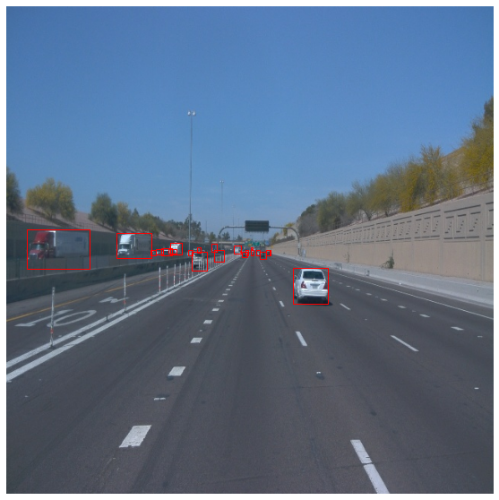

## Project Submission Writeup

### Project overview
This section should contain a brief description of the project and what we are trying to achieve. Why is object detection such an important component of self driving car systems?

### Set up
This section should contain a brief description of the steps to follow to run the code for this repository.

### Dataset
#### Dataset analysis
Exploratory data analysis was performed, and these sample output images were generated by the process.

Additional data analysis was performed, and this bar chart was the output.

#### Cross validation
This section should detail the cross validation strategy and justify your approach.

### Training
#### Reference experiment
This section should detail the results of the reference experiment. It should includes training metrics and a detailed explanation of the algorithm's performances.

#### Improve on the reference
This section should highlight the different strategies you adopted to improve your model. It should contain relevant figures and details of your findings.